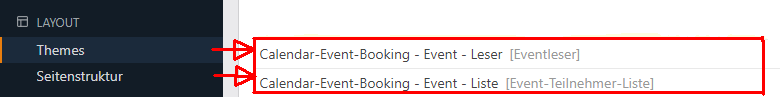
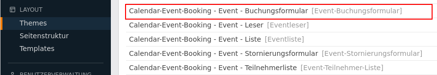

# Events buchen mit Contao

<mark style="background-color: yellow">Achtung: Bei der Migration von Version 5.x nach 6.x gab es zahlreiche <span style="text-decoration:underline;font-weight:bold">[Änderungen](https://github.com/markocupic/calendar-event-booking-bundle/blob/6.x/UPGRADE.md)</span>. Dies bitte bei einer allfälligen Migration berücksichtigen.</mark>

## Events buchen

Mit dieser Erweiterung für Contao CMS werden Events über ein Anmeldeformular buchbar. Verschiedene Buchungsstati stehen zur Verfügung.
Falls Events bereits ausgebucht sind, existiert **ab Version 6.0** die Möglichkeit, dass sich interessierte Besucher auf die **Warteliste** setzen lassen können.
Das Anmeldeformular kann im Contao Formulargenerator erstellt werden.
Die Erweiterung stellt während des Installationsprozesses ein Sample Anmeldeformular bereit, welches Grundansprüchen genügen sollte.
Die Werte des Formulars werden in der Datenbank in tl_cebb_registration abgelegt
und sind im Backend einsehbar und über eine CSV-Datei exportierbar.

## Benachrichtigung

Event-Organisator und Teilnehmer können bei Event-Buchungen und Event-Stornierungen über das Notification Center benachrichtigt werden.

## Frontend Module

#### Event Anmeldeformular

Mit einem Frontend Modul lässt sich auf einer Event-Reader Seite ein Event-Anmeldeformular einblenden.
Verlinken Sie in den Moduleinstellungen mit dem entsprechenden Formular aus dem Contao Formulargenerator.
Wichtig! Das Anmeldeformular zieht den Eventnamen aus der Url.
Der Event-Alias oder die Event-Id müssen deshalb zwingend als Parameter in der Url enthalten sein.
Das Anmeldeformular sollte deshalb idealerweise immer in Kombination mit dem Event-Reader-Modul eingebunden werden.

#### Angemeldete Mitglieder im Frontend auflisten

Mit einem weiteren Frontend Modul können zu einem Event bereits angemeldete Personen aufgelistet werden.
Wichtig! Das Auflistungsmodul zieht den Eventnamen aus der Url.
Der Event-Alias oder die Event-Id müssen deshalb zwingend als Parameter in der Url enthalten sein.
Das Mitgliederauflistungs-Modul sollte deshalb idealerweise immer in Kombination mit dem Event-Reader-Modul eingebunden werden.

#### Von Event abmelden

Die Erweiterung stellt auch eine Möglichkeit sich von einem Event wieder abzumelden.
Via Notification Center kann dem Teilnehmer ein Abmeldelink (##member_cancelRegistrationUrl##) zugeschickt werden.
Erstellen Sie das entsprechende Modul und binden Sie es auf einer neuen Seite in der Seitenstruktur ein.
Diese Seite sollten Sie sinnvollerweise in der Navigation nicht anzeigen lassen.
In der Kalendereinstellung legen Sie anschliessend fest, auf welcher Seite das Event-Abmeldeformular liegt.

#### Event Teilnehmer als CSV-Datei herunterladen (Encoding richtig einstellen)

Die Teilnehmer eines Events lassen sich im Backend als CSV-Datei (Excel) herunterladen.
In der `config/config.yaml` lässt sich das Encoding einstellen.
Standardmässig werden die Daten im Format **UTF-8** exportiert.
Es kann sein, dass Excel (bei entsprechender Einstellung), dann Umlaute falsch darstellt.
Das Problem kann behoben werden, wenn die `config/config.yaml` dahingehend anpasst wird,
dass die Inhalte vor dem Export von **UTF-8** nach **ISO-8859-1** konvertiert werden.

```
markocupic_calendar_event_booking:
  member_list_export:
    enable_output_conversion: true
    convert_from: 'UTF-8'
    convert_to: 'ISO-8859-1'
```
## Installation

### Über Composer
Ausführen: "composer require markocupic/calendar-event-booking-bundle"

### Über den Contao-Manager
Suche nach: "markocupic/calendar-event-booking-bundle"

## Einrichtung: empfohlener Ablauf

1. Kalender und Events anlegen:


2. "Eventliste" und "Eventleser" Frontend-Module anlegen:



3. Falls nicht schon geschehen, E-Mail-Gateway (Notification Center) anlegen:


4. Gegebenenfalls Benachrichtigung des Typs "Benachrichtigung bei Event Buchung" anlegen (Notification Center):


5. Gegebenenfalls Benachrichtigung des Typs "Benachrichtigung bei Event Stornierung" anlegen (Notification Center):


6. Im Contao Formulargenerator das automatisch generierte Formular anpassen und die benötigten Felder bereitstellen (evtl. DCA-Anpassung nötig):


7. Im Formular keine Weiterleitungsseite angeben. Diese muss im Frontend-Modul (nächster Schritt) gesetzt werden.

8. Das Frontend Modul "Event-Buchungsformular" erstellen und in den Modul-Einstellungen das bei Punkt 6 erstellte Formular auswählen und die Weiterleitungsseite angeben:




9. **Optional** das Frontend Modul "Event-Stornierungsformular" erstellen und dieses in einer extra dafür erstellten Seite einbinden. Die Seite mit dem Stornierungsformular muss bei der Kalendereinstellung hinterlegt werden.

10. **Optional** das Frontend Modul "Event-Mitglieder-Auflistung" erstellen und auf der Seite mit dem Eventleser Modul einbinden.

11. Die erstellten Module (Event-Buchungsformular, Eventleser und, falls vorhanden,die Eventliste) in der Contao Seiten- und Artikelstruktur einbinden 
**(Wichtig! Event-Buchungsformular und Eventleser gehören auf die gleiche Seite).**


12. Bei allen Events die Buchungs-, Benachrichtigungs- und Abmeldeoptionen konfigurieren.


13. In der Kalendereinstellung die Seite mit dem "Event-Abmeldeformular" festlegen.

#### Punkt 4: E-Mail Benachrichtigung im Notification Center konfigurieren

Versenden Sie beim Absenden des Formulars eine oder mehrere Nachrichten an den Teilnehmer oder eine Kopie an den Eventorganisator
und nutzen Sie dabei die **Simple Tokens**.

Mit ##member_cancelRegistrationUrl## kann ein tokengesicherter Event-Abmeldelink mitgesandt werden. Dazu muss aber im Event die Event-Stornierung erlaubt werden.
Auch sollte das dafür nötige Frontend Modul "Event-Abmeldeformular" erstellt und in einer Seite eingebunden worden sein.

##### Gebrauch der Simple Tokens im Notification Center

Teilnehmer:  ##member_gender## (Männlich, Weiblich oder Divers), ##member_salutation## (Übersetzt: Herr oder Frau), ##member_email##, ##member_firstname##, ##member_street##, etc. (Feldnamen aus tl_cebb_registration)

Event: ##event_title##, ##event_street##, ##event_postal##, ##event_location##, ##event_unsubscribeLimitTstamp##, etc. (Feldnamen aus tl_calendar_events)

Email-Absender: ##sender_name##, ##sender_email, etc. (Feldnamen aus tl_user)

#### Beispieltext Notification Center

```
{if member_gender=='Männlich'}
Sehr geehrter Herr ##member_firstname## ##member_lastname##
{elseif member_gender=='Weiblich'}
Sehr geehrte Frau ##member_firstname## ##member_lastname##
{else}
Hallo ##member_firstname## ##member_lastname##
{endif}

Hiermit bestätigen wir den Eingang Ihre Buchungsanfrage zur Veranstaltung "##event_title##" vom ##event_startDate##.

Buchungsstatus: ##member_bookingState##.

Bitte beachten Sie, dass Ihre Teilnahme erst nach erfolgter Prüfung definitiv wird. Sie erhalten dazu in den nächsten 1-2 Werktagen von uns die definitive Buchungsbestätigung.

Ihre Angaben:
Name/Vorname: ##member_firstname## ##member_lastname##
Adresse: ##member_street##, ##member_postal##, ##member_city##
Telefon: ##member_phone##
E-Mail: ##member_email##
Begleitpersonen: ##member_escorts##

{if enableUnsubscription=='1'}
Bitte benutzen Sie folgenden Link, um sich wieder von der Veranstaltung abzumelden:
##member_cancelRegistrationUrl##
{endif}

Freundliche Grüsse

##sender_name##
```

#### Überblick über alle Simple Tokens beim Gebrauch des Notification Centers

```
Array
(
    [admin_email] => admin@mi6.com
    [member_id] => 26
    [member_pid] => Testevent 2
    [member_tstamp] => 08.09.2021 21:26
    [member_eventState] => waiting_list
    [member_dateAdded] => 08.09.2021 21:26
    [member_notes] => Tomorrow never dies!
    [member_salutation] => Herr
    [member_firstname] => James
    [member_lastname] => Bond
    [member_gender] => Männlich
    [member_dateOfBirth] => 12. März 1976
    [member_street] => Casino Royale
    [member_postal] => 66666
    [member_city] => London
    [member_phone] => 23123
    [member_email] => 007@mi6.com
    [member_escorts] => 0
    [member_uuid] => d47636dd-7606-4f0b-ad8d-82461abde483
    [cart_id] => 3
    [order_id] => 1
    [order_orderUuid] => d47655xx-7606-4f0b-ad8d-82461abde483
    [event_id] => 3
    [event_pid] => Events
    [event_tstamp] => 08.09.2021 14:04
    [event_title] => Testevent 2
    [event_alias] => testevent-2
    [event_author] => Eve Moneypenny
    [event_addTime] => nein
    [event_startTime] => 00:00
    [event_endTime] => 23:59
    [event_startDate] => 16. September 2021
    [event_endDate] => 8. September 2021
    [event_location] => London
    [event_teaser] => Casino Royal
    [event_enableUnsubscription] => ja
    [event_eventBookingNotificationSender] => Eve Moneypenny
    [event_eventBookingNotification] => Event Buchungs Benachrichtigung
    [event_enableBookingNotification] => ja
    [event_maxEscortsPerMember] => 0
    [event_maxQuantityPerRegistration] => 0
    [event_maxMembers] => 11
    [event_bookingStartDate] => 7. Juni 2021
    [event_bookingEndDate] => 15. September 2021
    [event_enableBookingForm] => ja
    [event_location] => Nothingham
    [event_postal] => 6666
    [event_street] => black corner 2
    [event_allowDuplicateEmail] => ja
    [event_unsubscribeLimitTstamp] => 12.08.2021 16:40
    [event_minMembers] => 0
    [sender_id] => 1
    [sender_username] => eve.moneypenny
    [sender_name] => Eve Moneypenny
    [sender_email] => em@mi6.com
    [sender_language] => de,
    // etc.
)

```

#### Punkt 5: Event-Buchungsformular erstellen

Beim ersten Aufruf der Seite nach der Installation der Erweiterung wird **automatisch** ein Beispielformular mit allen benötigten Feldern generiert.
**Wichtig!!! Im Formular muss die Checkbox "Aktiviere Event-Buchungsformular-Funktion" aktiviert sein.** Weitere Einstellungen müssen keine zwingend gemacht werden.

Folgende Felder sind standardmässig im bereitgestellte Formular vorhanden und auch in der Datenbanktabelle `tl_cebb_registration` eingerichtet:
`firstname`,`lastname`,`gender`,`dateOfBirth`,`street`,`postal`,`city`,`phone`,`email`,`quantity`<sup>1</sup>,`escorts`<sup>2</sup>,`notes`

1 Benutzen Sie das Feld `quantity`, wenn Sie möchten, dass die im Feld eingetragene Ganzzahl zum Teilnehmertotal addiert wird.
Standardmässig (auch wenn das Feld im Formular weggelassen wird) ist dieser Wert 1.
Das Feld macht in einem Szenario Sinn, wo es möglich sein sollte, dass eine Person mehrere Tickets buchen darf.

2 Benutzen Sie das Feld `escorts`, wenn es sich um Begleitpersonen handelt, welche **nicht zum Teilnehmertotal addiert** werden sollen.

Werden weitere Felder gebraucht, so müssen diese unter `contao/dca/tl_cebb_registration.php` definiert werden.

### Beispieltext Notification Center

```
{if member_gender=='Männlich'}
Sehr geehrter Herr ##member_firstname## ##member_lastname##
{elseif member_gender=='Weiblich'}
Sehr geehrte Frau ##member_firstname## ##member_lastname##
{else}
Hallo ##member_firstname## ##member_lastname##
{endif}

Hiermit bestätigen wir den Eingang Ihre Buchungsanfrage zur Veranstaltung "##event_title##" vom ##event_startDate##.

Buchungsstatus: ##member_bookingState##.

Bitte beachten Sie, dass Ihre Teilnahme erst nach erfolgter Prüfung definitiv wird. Sie erhalten dazu in den nächsten 1-2 Werktagen von uns die definitive Buchungsbestätigung.

Ihre Angaben:
Name/Vorname: ##member_firstname## ##member_lastname##
Adresse: ##member_street##, ##member_postal##, ##member_city##
Telefon: ##member_phone##
E-Mail: ##member_email##
Begleitpersonen: ##member_escorts##

{if event_enableUnsubscription=='ja'}
Bitte benutzen Sie folgenden Link, um sich wieder von der Veranstaltung abzumelden:
##member_cancelRegistrationUrl##
{endif}

Freundliche Grüsse

##organizer_name##
```

### Überblick über alle Simple Tokens beim Gebrauch des Notification Centers

```
Array
(
    [admin_email] => admin@mi6.com
    [member_id] => 26
    [member_pid] => Testevent 2
    [member_tstamp] => 08.09.2021 21:26
    [member_bookingState] => cebb_booking_state_confirmed
    [member_dateAdded] => 08.09.2021 21:26
    [member_notes] => Tomorrow never dies!
    [member_salutation] => Herr
    [member_firstname] => James
    [member_lastname] => Bond
    [member_gender] => Männlich
    [member_dateOfBirth] => 12. März 1976
    [member_street] => Casino Royale
    [member_postal] => 66666
    [member_city] => London
    [member_phone] => 23123
    [member_email] => 007@mi6.com
    [member_quantity] => 1
    [member_escorts] => 0
    [member_uuid] => d47636dd-7606-4f0b-ad8d-82461abde483
    [member_cartUuid] => x34566dd-7606-4f0b-ad8d-82461abde483
    [member_orderUuid] => x34566dd-7606-4f0b-ad8d-82567abde112
    [order_uuid] => x34566dd-7606-4f0b-ad8d-82567abde112 // An order can contain multiple registrations
    [event_id] => 3
    [event_pid] => 1
    [event_tstamp] => 08.09.2021 14:04
    [event_title] => Testevent 2
    [event_alias] => testevent-2
    [event_author] => Eve Moneypenny
    [event_addTime] => nein
    [event_startTime] => 00:00
    [event_endTime] => 23:59
    [event_startDate] => 16. September 2021
    [event_endDate] => 8. September 2021
    [event_location] => London
    [event_teaser] => Lorem ipsum
    [event_enableUnsubscription] => ja
    [event_eventBookingNotificationSender] => Eve Moneypenny
    [event_eventBookingNotification] => Event Buchungs Benachrichtigung
    [event_enableBookingNotification] => ja
    [event_maxEscortsPerMember] => 0
    [event_maxMembers] => 11
    [event_bookingStartDate] => 7. Juni 2021
    [event_bookingEndDate] => 15. September 2021
    [event_enableBookingForm] => ja
    [event_location] => Nothingham
    [event_postal] => 6666
    [event_street] => black corner 2
    [event_allowDuplicateEmail] => ja
    [event_unsubscribeLimitTstamp] => 12.08.2021 16:40
    [event_minMembers] => 0
    [sender_id] => 1
    [sender_username] => eve.moneypenny
    [sender_name] => Eve Moneypenny
    [sender_email] => em@mi6.com
    [sender_language] => de
)

```

[Dokumentation](https://docs.contao.org/dev/getting-started/starting-development/#contao-configuration-translations)

```php
<?php
// contao/dca/tl_cebb_registration.php

use Contao\CoreBundle\DataContainer\PaletteManipulator;

// Add a field to tl_cebb_registration
$GLOBALS['TL_DCA']['tl_cebb_registration']['fields']['foodHabilities'] = [
    'exclude'   => true,
    'search'    => true,
    'sorting'   => true,
    'inputType' => 'select',
    'options'   => ['vegetarian', 'vegan'],
    'eval'      => ['includeBlankOption' => true, 'tl_class' => 'w50'],
    'sql'       => "varchar(255) NOT NULL default ''",
];

// Add a new legend and the custom field to the default palette.
Contao\CoreBundle\DataContainer\PaletteManipulator::create()
    ->addLegend('food_legend', 'personal_legend', PaletteManipulator::POSITION_AFTER)
    ->addField(['foodHabilities'], 'food_legend', PaletteManipulator::POSITION_APPEND)
    ->applyToPalette('default', 'tl_cebb_registration');

```

#### Punkt 11: E-Mail Buchungsbestätigung im Event aktivieren

Aktivieren Sie beim Event die Buchungsbestätigung mit dem Notification Center, wählen Sie eine Benachrichtigung aus und legen Sie einen Absender mit einer gültigen E-Mail-Adresse (tl_user) fest.


### Template Variablen

Folgende TWIG Functions sind in allen Twig-Templates einsetzbar:

| Twig functions                                           | type                | Erklärung                                                                                 |
|----------------------------------------------------------|---------------------|-------------------------------------------------------------------------------------------|
| `{{ cebb_event_get_event() }}`                           | CalendarEventsModel | Gibt das Model des aktuellen Events zurück. Der Event-Alias wird aus dem Request gezogen. |
| `{{ cebb_event_get_event(event_id) }}`                   | CalendarEventsModel | Gibt das Model eines beliebigen Events zurück.                                            |
| `{{ cebb_event_get_registrations(event_id) }}`           | array               | Alle Event Registrierungen als mehrdimensionales Array.                                   |
| `{{ cebb_event_get_number_free_seats(event_id) }}`       | int                 | Die Anzahl freier Plätze                                                                  |
| `{{ cebb_event_get_number_free_seats(event_id) }}`       | int                 | Die Anzahl freier Plätze auf der Warteliste                                               |
| `{{ cebb_event_get_confirmed_booking_count(event_id) }}` | bool                | Die Anzahl bestätigter Buchungen.                                                         |
| `{{ cebb_event_is_fully_booked(event_id) }}`             | bool                | Zeigt an, ob der Event ausgebucht ist oder nicht.                                         |

## Wie kann ich die Step Templates anpassen?

Für jeden Schritt im Checkout-Prozess (standardmässig gibt es nur zwei)
finden Sie unter `/vendor/markocupic/calendar-event-booking-bundle/contao/templates/checkout` die Original TWIG templates.
Sie können die Templates an Ihre Bedürfnisse anpassen und anschliessend unter `/contao/templates` ablegen.
In der Konfigurationsdatei `config/config.yaml` müssen die angepassten Templates zusätzlich noch registriert werden. Danach den Symfony-Cache mit `composer install` neu aufbauen.

```yaml
# config/config.yaml
markocupic_calendar_event_booking:
    checkout:
        default:
            steps:
                subscribe:
                    template: '@Contao_App/my_custom_checkout_step_subscribe.html.twig'
                finalize:
                    template: '@Contao_App/my_custom_checkout_step_finalize.html.twig'
 ```

## Mit Event Listeners Frontend Module erweitern/anpassen

Vor allem das Modul "Buchungsformular" lässt sich sehr gut erweitern. Es lassen sich Event Listener dazuprogrammieren, welche das Standardverhalten der Extension verändern oder die Programmlogik erweitern.
